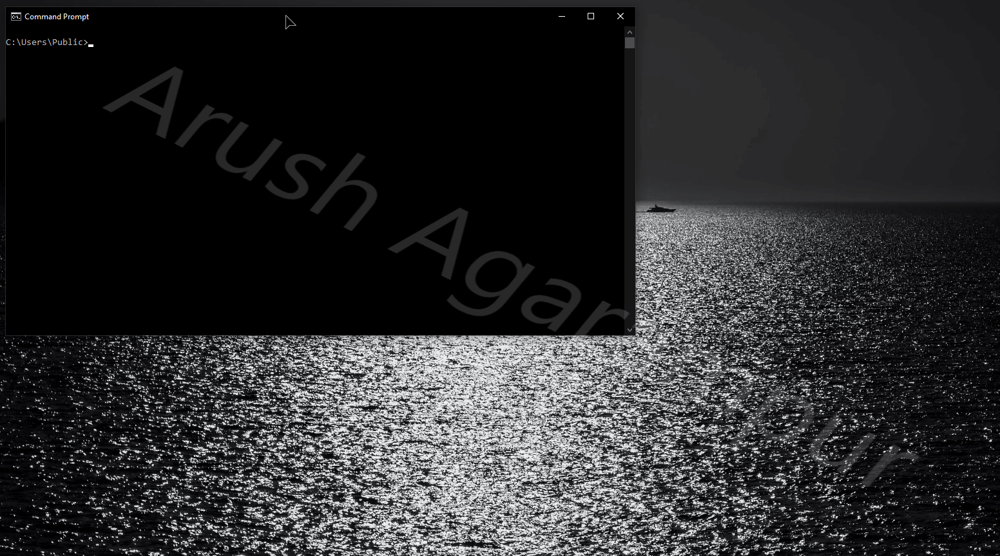

# ByeIntegrity — Windows UAC Bypass
Bypass User Account Control (UAC) to gain elevated (Administrator) privileges to run any program at a high integrity level.

## How it works
ByeIntegrity hijacks a DLL located in the Native Image Cache (NIC). The NIC is used by the .NET Framework to store optimized .NET Assemblies that have been generated from programs like Ngen, the .NET Framework Native Image Generator. Because Ngen is usually run under the current user with Administrative privileges through the Task Scheduler, the NIC grants modify access for members of the Administrators group.

The Microsoft Management Console (MMC) Windows Firewall Snap-in uses the .NET Framework, and upon initializing it, modules from the NIC are loaded into the MMC process. The MMC executable uses AutoElevate, a mechanism Windows uses that automatically elevates a process’s token without UAC prompting.

ByeIntegrity hijacks a specific DLL located in the NIC named `Accessibility.ni.dll`. It writes some shellcode into an appropriately-sized area of padding located in the `.text` section of the DLL. The entry point of the DLL is then updated to point to the shellcode. Upon DLL load, the entry point (which is actually the shellcode) is executed. The shellcode calculates the address of `kernel32!CreateProcessW`, creates a new instance of `cmd.exe` running as an Administrator, and then simply returns `TRUE`. This is only for the `DLL_PROCESS_ATTACH` reason; all other reasons will immediately return `TRUE`.
## UACME
This attack is implemented in UACME as method #63. If you want to try out this attack, please, use UACME first. The attack is the same, however, UACME uses a different method to modify the NIC. ByeIntegrity uses `IFileOperation` while UACME uses `ISecurityEditor`. In addition, UACME chooses the correct `Accessibility.ni.dll` for your system and preforms the system maintenance tasks if necessary (to generate the NIC components). ByeIntegrity simply chooses the first NIC entry that exists (which may/may not be the correct entry that MMC is using) and does not run the system maintenance tasks. ByeIntegrity contains **significantly** more code than UACME, so reading the UACME implementation will be much easier to understand than reading the ByeIntegrity code. Lastly, ByeIntegrity launches a child process during the attack whereas UACME does not.

**tl;dr: UACME is simpler and more effective than ByeIntegrity, so use UACME first.**
## Using the code
If you’re reading this then you probably know how to compile the source. Just note that this hasn’t been tested or designed with x86 in mind at all, and it probably won’t work on x86 anyways.

Just like UACME, **I will never upload compiled binaries to this repo.** There are always people who want the world to crash and burn, and I'm not going to provide an easy route for them to run this on somebody else's computer and cause intentional damage. I also don't want script-kiddies to use this attack without understanding what it does and the damage it can cause.
## Supported Versions
This attack works from Windows 7 (7600) up until the latest version of Windows 10.
